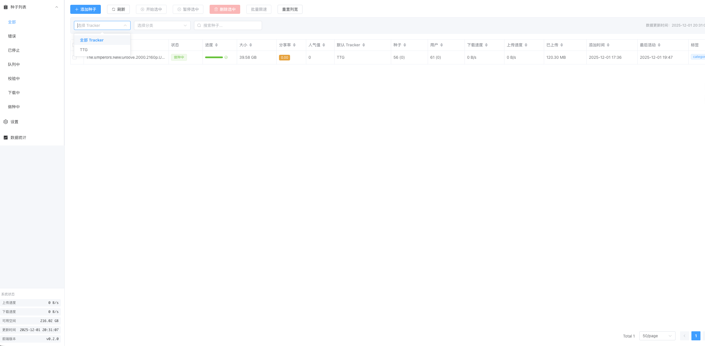
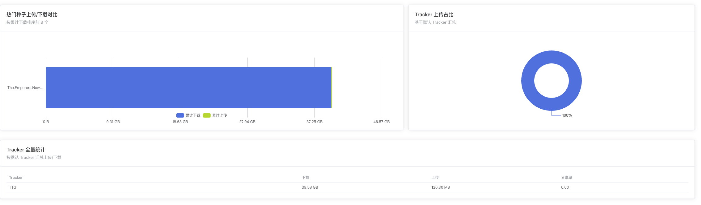
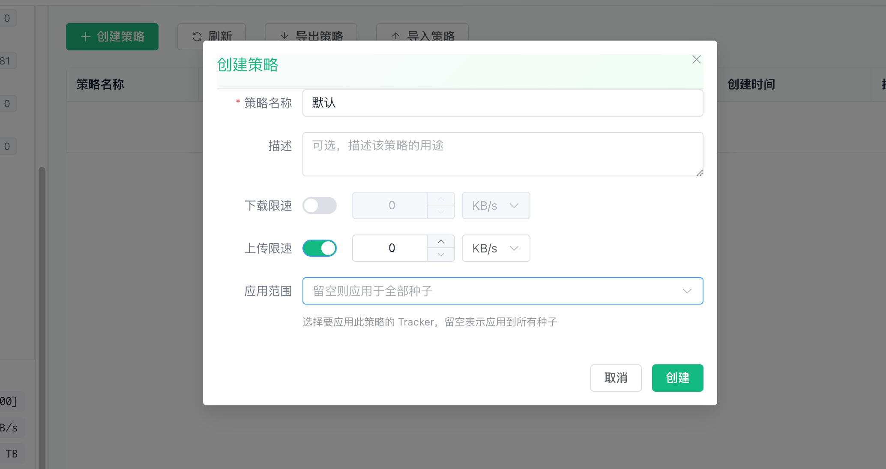

# BitCake 🍰

**中文** | [English](./README_EN.md)

> 专门针对 PT 玩家优化的下载器 WebUI - 优先支持 Transmission - 理论上兼容 qBittorrent

> 感谢 jackloves111 的加入和贡献

## 📖 项目简介

BitCake 是一个专为 PT（Private Tracker）用户设计的现代化 Transmission 和 qBittorrent Web 界面。它提供了简洁、高效且功能丰富的种子管理体验。

## ✨ 特性

- 🚀 基于 Vue 3 + TypeScript + Vite 构建
- 🎯 统一接口，同时支持 Transmission 和 qBittorrent
- 📱 响应式设计，完美支持移动端访问
- 🎨 使用 Element Plus 组件库，界面美观现代
- 📊 强大的数据统计与可视化功能
- 🔧 紧凑的布局设计，信息密度更高
- 🌍 多语言支持（中文 & 英文）
- 🎨 多主题选择（清新绿、简约蓝、可爱粉）
- 🏷️ 高级种子管理，支持标签和分类
- ⚡ 批量操作和限速策略
- 📈 实时速度监控和 Tracker 统计
- 🔄 辅种管理，支持跨站做种

## 🚀 部署

### 方式一：使用预构建容器（推荐）

最简单的方式是使用预构建的 Docker 镜像：

```yaml
services:
  transmission:
    image: ghcr.io/wenfer/bitcake:latest
    container_name: transmission
    environment:
      - PUID=1000
      - PGID=1000
      - TZ=Etc/UTC
      - USER= #可选
      - PASS= #可选
      - WHITELIST= #可选
      - PEERPORT= #可选
      - HOST_WHITELIST= #可选
    volumes:
      - /path/to/transmission/data:/config
      - /path/to/downloads:/downloads #可选
      - /path/to/watch/folder:/watch #可选
    ports:
      - 9091:9091
      - 51413:51413
      - 51413:51413/udp
    restart: unless-stopped
```

> 注意：使用此镜像时，默认 UI 已经是 BitCake，无需额外配置 WebUI 路径。

---

### 方式二：原生安装部署

如果你不想使用 Docker，可以直接部署到现有的 Transmission 或 qBittorrent 实例。

#### 准备工作

1. **环境要求**
   - 已安装并运行 Transmission 或 qBittorrent
   - WebUI 功能已启用
   - 能够访问下载器的 Web 界面

2. **下载 BitCake**
   
   从 [Releases](https://github.com/wenfer/bitcake/releases) 页面下载对应版本的预构建文件：
   - `bitcake-transmission.zip` - Transmission 版本
   - `bitcake-qbittorrent.zip` - qBittorrent 版本

#### 部署到 Transmission

Transmission 4.0+ 版本的 WebUI 目录名为 `public_html`，旧版本为 `web`。

**方法 A：一键部署脚本（推荐）**

```bash
# 使用 curl 直接执行
sudo curl -fsSL https://raw.githubusercontent.com/wenfer/bitcake/main/scripts/deploy-transmission.sh | bash

# 或先下载再执行
curl -fsSL -o deploy-transmission.sh https://raw.githubusercontent.com/wenfer/bitcake/main/scripts/deploy-transmission.sh
sudo bash deploy-transmission.sh
```

脚本会自动检测 Transmission 版本并安装到正确的目录。

**方法 B：手动部署**

1. 找到 Transmission 的 WebUI 目录：
   - Transmission 4.0+: `/usr/share/transmission/public_html`
   - Transmission 3.x: `/usr/share/transmission/web`
   - 或通过 `TRANSMISSION_WEB_HOME` 环境变量指定

2. 备份原有文件：
```bash
# Transmission 4.0+
sudo mv /usr/share/transmission/public_html /usr/share/transmission/public_html.backup

# Transmission 3.x
sudo mv /usr/share/transmission/web /usr/share/transmission/web.backup
```

3. 下载并解压 BitCake：
```bash
# 创建目录（以 Transmission 4.0+ 为例）
sudo mkdir -p /usr/share/transmission/public_html

# 下载最新版本
cd /tmp
wget https://github.com/wenfer/bitcake/releases/latest/download/bitcake-transmission.zip

# 解压
sudo unzip bitcake-transmission.zip -d /usr/share/transmission/public_html

# 设置权限
sudo chmod -R 755 /usr/share/transmission/public_html
```

4. 重启 Transmission：
```bash
sudo systemctl restart transmission-daemon
# 或
sudo service transmission-daemon restart
```

**方法 C：使用环境变量（无需替换系统文件）**

1. 将 BitCake 解压到任意目录：
```bash
sudo mkdir -p /opt/bitcake
sudo unzip bitcake-transmission.zip -d /opt/bitcake
```

2. 设置环境变量并启动 Transmission：
```bash
export TRANSMISSION_WEB_HOME=/opt/bitcake
transmission-daemon
```

或在 systemd 服务中设置：
```ini
[Service]
Environment="TRANSMISSION_WEB_HOME=/opt/bitcake"
```

#### 部署到 qBittorrent

**方法 A：一键部署脚本（推荐）**

```bash
# 使用 curl 直接执行
curl -fsSL https://raw.githubusercontent.com/wenfer/bitcake/main/scripts/deploy-qbittorrent.sh | bash

# 或先下载再执行
curl -fsSL -o deploy-qbittorrent.sh https://raw.githubusercontent.com/wenfer/bitcake/main/scripts/deploy-qbittorrent.sh
bash deploy-qbittorrent.sh
```

**方法 B：手动部署**

1. 创建 BitCake 目录：
```bash
mkdir -p ~/.config/qBittorrent/bitcake
```

2. 下载并解压：
```bash
cd /tmp
wget https://github.com/wenfer/bitcake/releases/latest/download/bitcake-qbittorrent.zip
unzip bitcake-qbittorrent.zip -d ~/.config/qBittorrent/bitcake
```

3. 在 qBittorrent 设置中启用：
   - 打开 qBittorrent WebUI
   - 进入 **设置** → **WebUI** → **使用替代 WebUI**
   - 勾选"使用替代 WebUI"
   - 在"文件路径"中填写：`/home/你的用户名/.config/qBittorrent/bitcake`

4. 保存设置，刷新页面

> **注意**：如果修改后无法访问 qBittorrent，可以通过以下 API 调用恢复默认 UI：
> ```bash
> curl "http://{你的qb地址}/api/v2/app/setPreferences?json=%7B%22alternative_webui_enabled%22:false%7D"
> ```

#### 使用 Nginx 反向代理（可选）

如果你想通过子路径访问 BitCake：

```nginx
server {
    listen 80;
    server_name your-domain.com;

    location /bitcake/ {
        alias /opt/bitcake/;
        index index.html;
        try_files $uri $uri/ /bitcake/index.html;
    }

    # Transmission API 代理
    location /transmission/rpc {
        proxy_pass http://127.0.0.1:9091/transmission/rpc;
        proxy_set_header Host $host;
        proxy_set_header X-Real-IP $remote_addr;
    }
}
```

#### 自动更新脚本

创建一个简单的更新脚本：

```bash
#!/bin/bash
# update-bitcake.sh

INSTALL_DIR="/opt/bitcake"
BACKUP_DIR="/opt/bitcake.backup.$(date +%Y%m%d)"
DOWNLOAD_URL="https://github.com/wenfer/bitcake/releases/latest/download/bitcake-transmission.zip"

# 备份现有版本
if [ -d "$INSTALL_DIR" ]; then
    cp -r "$INSTALL_DIR" "$BACKUP_DIR"
fi

# 下载最新版本
cd /tmp
wget -O bitcake-latest.zip "$DOWNLOAD_URL"

# 解压并替换
rm -rf "$INSTALL_DIR"
unzip bitcake-latest.zip -d "$INSTALL_DIR"

# 清理
rm bitcake-latest.zip

echo "BitCake 已更新到 $INSTALL_DIR"
echo "备份位于: $BACKUP_DIR"
```

## 🔧 配置说明

### Tracker 站点映射

BitCake 在 `public` 目录下包含 `trackerSites.json` 文件，用于将 Tracker URL 映射到站点名称。这使得在统计和列表中更容易通过站点名称识别种子。

配置支持国际化，不同语言使用独立的映射文件：
- `trackerSites-zh-CN.json` - 中文站点名称
- `trackerSites-en-US.json` - 英文站点名称

欢迎贡献更多 Tracker 映射！

### 登录认证

- **qBittorrent**：必须提供用户名和密码（使用 qBittorrent 设置的凭据）
- **Transmission**：如果 Transmission 启用了认证，需要提供凭据；否则可留空

### 退出登录

点击右上角的退出按钮即可注销。

## 💻 开发

### 环境要求

- Node.js 18+
- npm 或 yarn

### 环境变量

在项目根目录创建 `.env` 文件：

```bash
# 后端类型：'transmission' 或 'qbittorrent'
VITE_TORRENT_BACKEND=transmission

# 自定义 API 基础路径（可选）
VITE_TORRENT_API_BASE=/transmission/rpc

# 开发代理 URL（可选）
VITE_PROXY_TRANSMISSION_URL=http://localhost:9091
VITE_PROXY_QB_URL=http://localhost:8080
```

### 构建命令

```bash
# 安装依赖
npm install

# 开发服务器
npm run dev

# 构建 Transmission 版本
npm run build:transmission

# 构建 qBittorrent 版本
npm run build:qbittorrent

# 构建生产版本（通用）
npm run build:both
```

## 🎨 预览


*主界面 - 高级筛选功能*


*全面的统计数据和图表*


*批量限速管理*

## 🙏 致谢

- [Vue.js](https://vuejs.org/) - 渐进式 JavaScript 框架
- [Element Plus](https://element-plus.org/) - Vue 3 组件库
- [ECharts](https://echarts.apache.org/) - 数据可视化图表库
- [Transmission](https://transmissionbt.com/) - 轻量级 BT 客户端
- [qBittorrent](https://www.qbittorrent.org/) - 开源 BT 客户端

## 🤝 贡献

欢迎贡献代码！请随时提交 Pull Request。

## 📄 License

MIT License

---

用 ❤️ 为 PT 爱好者打造
